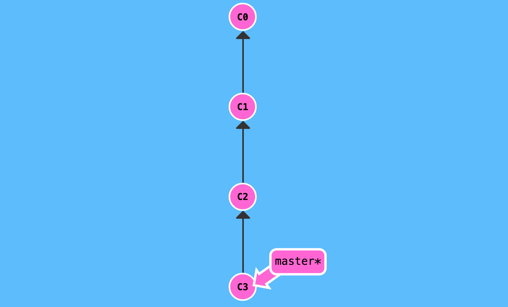

# Git: Basics

 

## Commits

A **commit** in a git repository records a snapshot of all (tracked) files in a directory. Think of it like how you copy & paste things from one location to another.

Git doesn't blindly copy the entire repository each time you commit. It compresses a commit - when possible - as a set of changes - **delta** - from one version of the repo to another.

Git maintains a history of all changes that have ever been made to a repository.

 

 

## [Commit Tree](<https://git-scm.com/docs/git-commit-tree>)

### HEAD

**HEAD** is the name which refers to a currently checked out commit -- essentially the commit you're working on top of.

HEAD points to the most recent commit reflected in the working tree. Generally, HEAD points to a branch name and when you commit, the status of that branch is changed which is visible through the HEAD.

 

### Detaching HEAD

 
