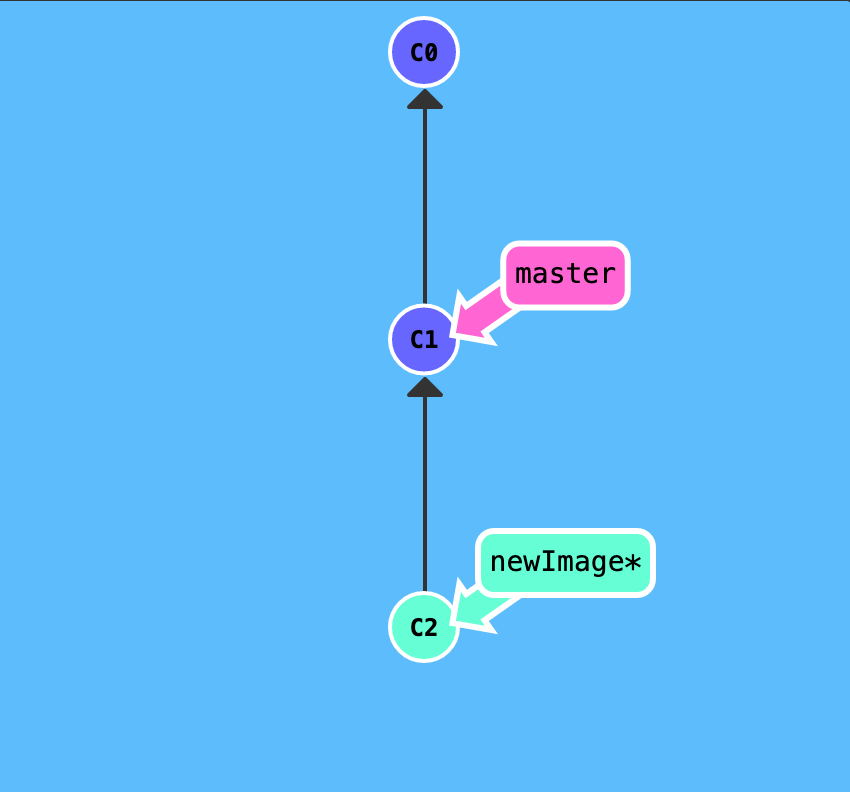
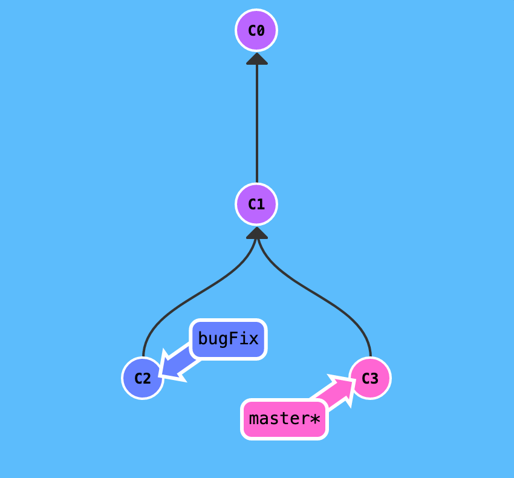
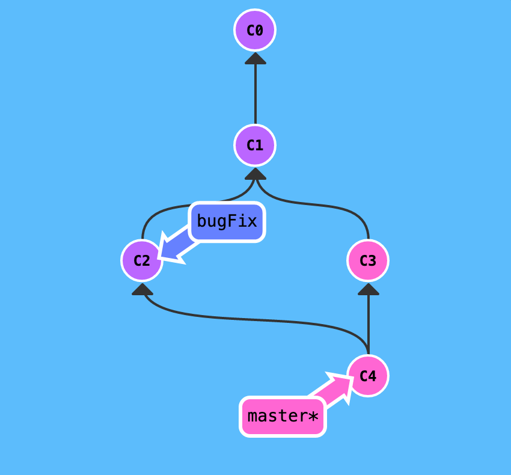
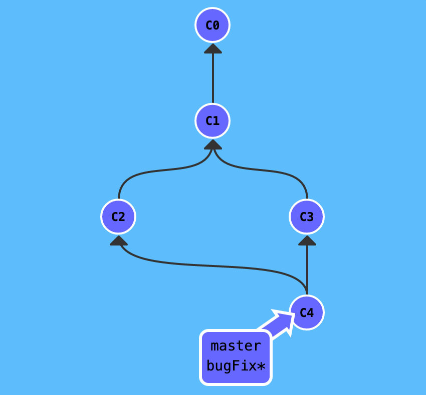
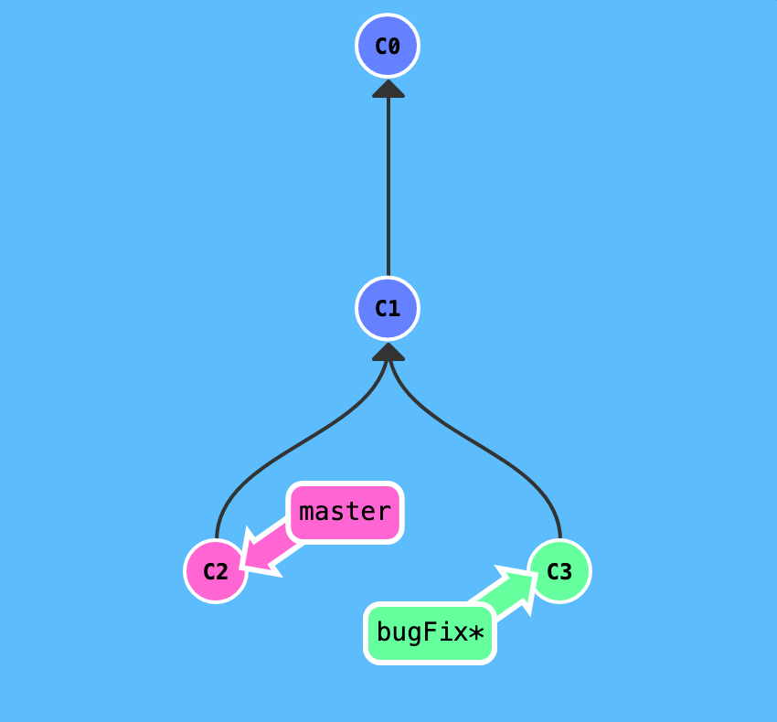
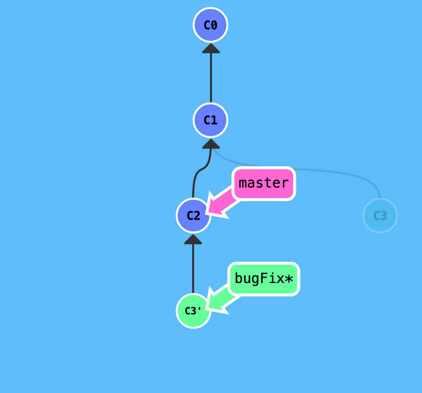
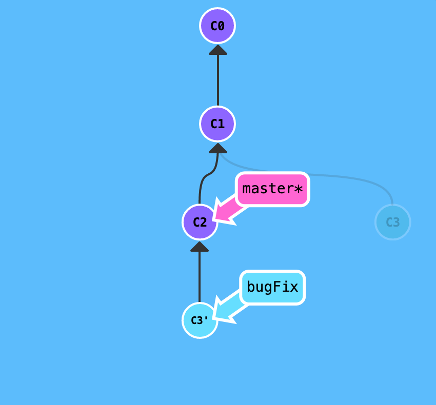
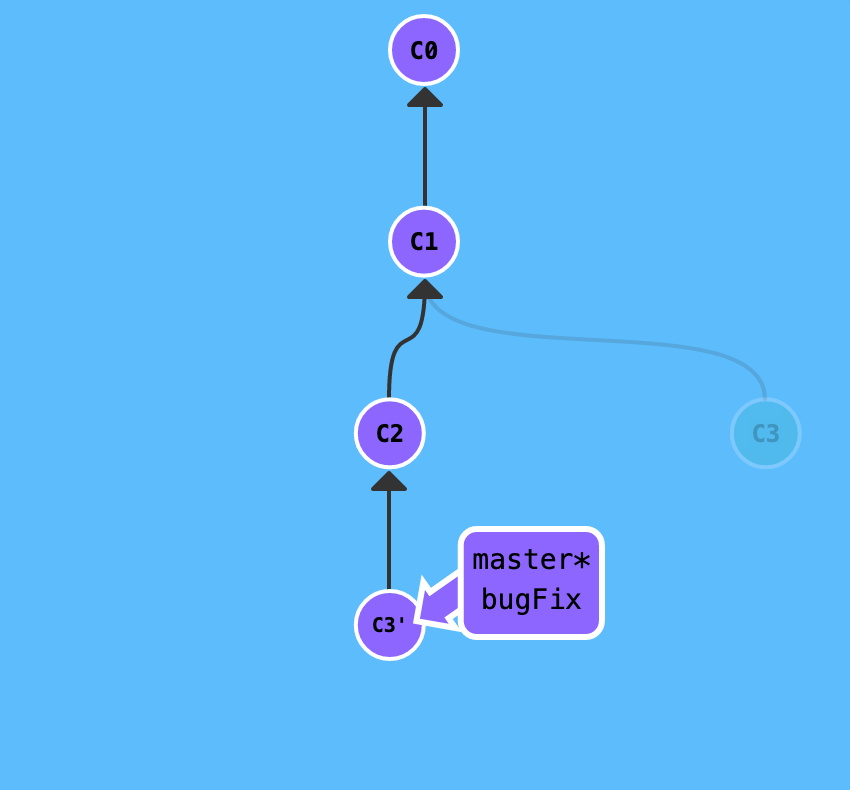

# Git: [Basics](<https://git-scm.com/book/en/v2/Git-Basics-Getting-a-Git-Repository>)

 

## [Branches](<https://git-scm.com/book/en/v2/Git-Branching-Branches-in-a-Nutshell>)

Git **branches** are pointers to commits. They allow for multiple versions of the main repo to be worked on simulataneously.

To create a new branch, first make sure that you're in the `main` branch and run the following command from your terminal:

`git branch <branch_name>`
`git checkout <branch_name>`

OR

`git checkout -b <branch_name>`

 

 

## [Merging Branches](<https://git-scm.com/book/en/v2/Git-Branching-Basic-Branching-and-Merging>)

In git, **merging** branches is a way of combining two separate branches into one repository. This allows for multiple developers to _branch off_ from the main repo and combine features at a later time.

Merging a commit from a branch creates two unique parents.

You can merge branches one of two ways. The first way is by using the `git merge` command.

 

### 1. Git Merge

Below - two separate branches are being worked on. One branch is **`bugFix`** the other is **`main`**.

 

 

From the terminal under the `main` branch, run the following command:

**`$ git merge bugFix`**

 

### 2. [Git Rebase](<https://git-scm.com/book/en/v2/Git-Branching-Rebasing>)

The second way to merge branches is by what is referred to as **Git Rebase**.

With rebasing, you can take the patch of the change from a separate branch and reapply it on top of its parent.

With the `rebase` command, you can take all the changes that were committed on one branch and replay them on a different branch.

 

 

 

